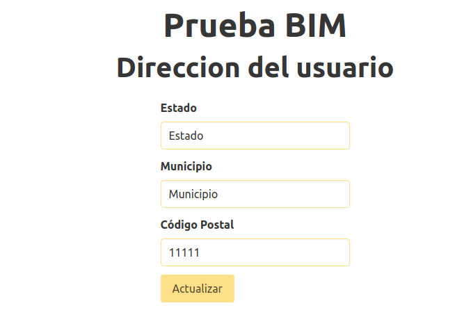

# Front-React

Front para conectar con un servicio REST usando Spring. Ejemplo de persistencia de seguridad de la información accediendo unicamente desde el login, crear nuevo usuario y formulario para visualizar y actualizar información.

<h3 align="left">Lenguaje y Tecnologias:</
<br/>
<p align="left">
<a href="https://reactjs.org/" target="_blank" rel="noreferrer">  </a> <a href="https://developer.mozilla.org/en-US/docs/Web/JavaScript" target="_blank" rel="noreferrer">  </a> 
<a href="https://bulma.io/" target="_blank" rel="noreferrer">  </a>
<a href="https://www.w3.org/html/" target="_blank" rel="noreferrer">  </a>
<a href="https://www.w3schools.com/css/" target="_blank" rel="noreferrer">  </a> 

</p>

## Instalación y ejecución

Para ejecutar el proyecto se deben instalar los modulos, ejecutar los siguientes comandos:

```bash
npm install
npm start
```

> **_NOTA:_** Antes se debe tener iniciado el serivdor con su configuración correspondiente, más información en el siguiete [repositorio](https://github.com/Eliel0328/bim-spring-back)

## Descripcion del desarrollo e implementación

Este proyecto tiene como objetivo conectar un login, registro y un formulario a una base de datos mediante el uso de un servicio REST.

### Las especificaciones

-   Creación aplicativa, considerar
    1. Pantalla registro, formato: `correo-usuario-contraseña`
        1. Integrar interceptores para cifrado de datos
    2. Pantalla acceso, formato: `usuario-contraseña`
    3. Pantalla formularia, considerar
        1. Captura 3 campos, en tres tablas relacionadas
            - `Estado`
            - `Municipio`
            - `CP`
        2. Solo accesible a través de login
        3. Conexión a base de datos relacional
        4. Servicio REST para persistir los datos del formulario, con método POST en formato JSON
        5. Incluir seguridad para los servicios

A continuación se describe el proceso que se sigue para cumplir con las especificaciones.

### Conexión con Servidor

Se debe crear la base datos, para lo cual se debe ingresar la dirección en el siguiente archivo `src/util/const.js`

```JS
export const SERVER_URL = ${URL_SERVER}
```
### Vistas
#### Login

Formulario para ingresar a ver el resto de información disponible. Se debe ingresar información registrada previamente para ingresar. Devuelve un token para el resto de peticiones.

<div align="center">
    
</div>

#### Registro

Registrar Usuario y Correo único para poder registrar un nuevo usuario. Una registrada información valida se pasa a la url `/direccion` donde se puede ver el resto de la información.

<div align="center">
    
</div>

#### Dirección

Formulario para ver y actualizar la información de la dirección de un usuario.

<div align="center">
    
</div>


### Seguridad

Para proteger la información, unicamente puede acceder a la url `/direccion` cuando se tiene registrado un token valido. Todas las otras urls redirigen a `/home` en los casos en los que no se tiene un token valido. 